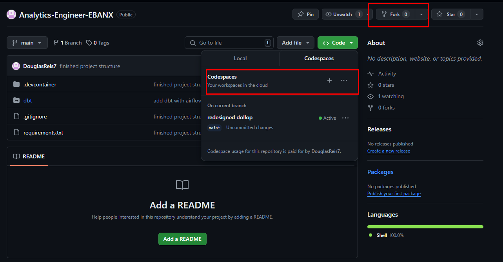

Overview
========

Este projeto foi desenvolvido para participação do processo seletivo de Analytics Engineer Pleno do EBANX, pelo candidato Douglas Reis Silva.

-------------------------------

Como usar esse repositório
==========================
## Ligando

1. Utilize do Github Codespaces, dando fork neste repositório e criando um Codespace no GitHub.

2. Ao entrar no codespace, deve-se aguardar alguns minutos até que as instruções presentes no arquivo devcontainer.json sejam concluídos (este arquivo instalará as dependências e executará todos os comandos necessários para visualização do projeto)

3. Você poderá acessar as tabelas dos layers Silver e Gold executando `python dbt/test.py` para visualizar os dados ingeridos no banco de dados DuckDB.

4. Você também pode acessar a documentação do DBT, com a descrição, testes e timeline de todos os modelos através da porta 8080, disponível na aba 'Portas' do terminal do Github Codespace.